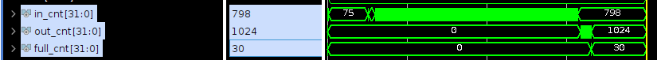

This repo is for RTL simulation for PR-Flow project. It's a bit complicated...

```c
├── mono_ver
│   └── hls_gen_prj
│   │   └── data_gen_rendering_src           // HLS source codes for data_gen_config module. Application-specific.
│   └── rendering
│       ├── rendering_prj                    // Vivado project for simulation.
│       └── src                       
│       │   ├── hls_gen              
│       │   │   ├── applications             // HLS-generated source codes.
│       │   │   └── data_gen_config_is_done  // HLS-generated data_gen_config module.
│       │   └── verilog                      // monolithic RTL source codes.
├── NoC_ver
│   └── hls_gen_prj
│   │   ├── config_parser_src                // HLS source codes for config_parser module. 
│   │   ├── data32to512_src                  // HLS source codes for data32to512 module. 
│   │   └── data_gen_rendering_src           // HLS source codes for data_gen_config module. Application-specific.
│   └── rendering
│       ├── rendering_prj                    // Vivado project for simulation
│       └── src                       
│       │   ├── hls_gen              
│       │   │   ├── applications             // HLS-generated source codes
│       │   │   ├── config_parser_is_done    // HLS-generated config_parser module
│       │   │   ├── data32to512              // HLS-generated data32to512 module
│       │   │   └── data_gen_config_is_done  // HLS-generated data_gen_config module
│       │   └── verilog                      // NoC ver. RTL source codes
```

## NoC version

### Step 1 - Prepare HLS-generated RTL
#### data_gen_rendering_config
1. Copy the code section of NoC configuration in the Rendering application's `{PR_FLOW_PRJ_DIR}/workspace/F005_bits_rendering/rendering/host/host.cpp` to `./NoC_ver/hls_gen_prj/host.cpp`.
2. Run `hls_top_gen.py` and copy paste the printed out text to `data_gen_rendering.cpp`. Note that tmp2 part may need to be manually adjusted. Don't forget the "start page" part in the end.
3. Create HLS project, add `data_gen_rendering.cpp`, and run HLS-synthesis. Use generated RTL files in `HLS_PRJ_DIR/solution1/syn/verilog/`.

#### config_parser, data32to512
Similar to data_gen_config.

### Step 2 - Create Simulation project

#### HLS-generated files
Copy the HLS-generated files to `./NoC_ver/rendering/src`. Use files from
`{PR_FLOW_PRJ_DIR}/workspace/F002_hls_rendering/{OPERATOR_NAME}_prj/{OPERATOR_NAME}/syn/verilog/` for `./NoC_ver/rendering/src/application/`.

#### Verilog
1. Need to modify dut.v. What leaf pages we will use...
2. Copy necessary files from `{PR_FLOW_PRJ_DIR}/workspace/F003_syn_rendering/{OPERATOR_NAME}_prj/src/` to `./NoC_ver/rendering/src/verilog/app_speicific/`.

#### Simulation Project
1. Create Vivado project (`./NoC_ver/rendering/rendering_prj/`). Add all the source codes in `./NoC_ver/rendering/rendering_prj/src/`. Make sure you add `.dat` files as well.
2. Set `test` as the top function. Run simulation. For Rendering benchmark, the input count should be 798, and the output count should be 1024 as shown below.
3. Use `counter_analyze.py` to check the counters.



## Monolithic version

### Step 1 - Prepare HLS-generated RTL
Create HLS project, add `data_gen_rendering.cpp`, and run HLS-synthesis. Use generated RTL files in `HLS_PRJ_DIR/solution1/syn/verilog/`.
In fact, in monolithic version's simulation, we don't need to set `tmp1` in `data_gen_is_done.cpp`, but I still keep them...

### Step 2 - Create Simulation project

#### HLS-generated files
Same as NoC version.

#### Verilog
Copy `{PR_FLOW_PRJ_DIR}/workspace/F007_mono_rendering/zcu102/mono_syn/mono_src/mono.v` to `./NoC_ver/rendering/src/verilog/mono.v`.

#### Simulation Project
Same as NoC version. 
Counter extraction is slightly different from when we run things on HW.
When we run it on HW, it sends a dummy configuration `CONFIG_SIZE` (which must have been set to 1 in `host.cpp`) times. 
Then, full, empty, read, and stall counters are sent back to host.
To imitate the exact behavior from simulation, we need RTL(HLS-generated) associated with the C code below.

```c
// some code in ydma.cpp

	    	for(int i=0; i<config_size; i++){ v1_buffer[i] = input1[i]; } // config_size must have been set to 1 in monolithic case
	    	for(int i=0; i<num_total_cnt; i++){ output1[i] = v1_buffer[i]; }

// some more code below
```

However, I was lazy and kind or ignored this part...
Current structure is enough to test the functionality.

